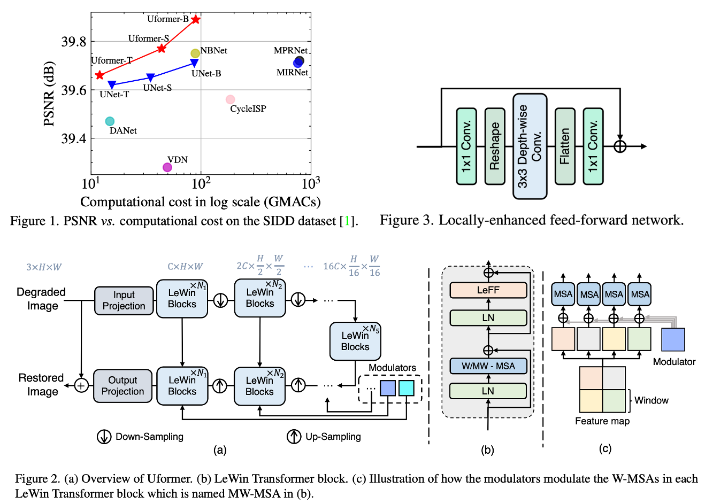

# Revolutionizing EMCCD Denoising through Noise Modeling

Official implementation of the ICLR 2025 paper **“Revolutionizing EMCCD
Denoising through a Novel Physics-Based Learning Framework for Noise
Modeling.”** The method calibrates an electron-multiplying CCD (EMCCD), uses
the resulting photon, multiplication, and read-noise distributions to generate
training pairs from clean microscopy images, and trains a grayscale Uformer-B
without requiring noisy/clean captures for every scene.

[[Paper](https://proceedings.iclr.cc/paper_files/paper/2025/hash/0cd1eec0eeaf5ce1bf6d8875a7c1d095-Abstract-Conference.html)]
[[Data and checkpoints](docs/DATA.md)]



## Installation

Python 3.9–3.11 and a CUDA-capable PyTorch installation are recommended.

```bash
python -m venv .venv
source .venv/bin/activate
pip install -r requirements.txt
pip install -e .
```

For the paper's LPIPS benchmark, also install `pip install -e '.[benchmark]'`.

The original Python 3.7-era package versions are recorded in
[`requirements-legacy.txt`](requirements-legacy.txt), but are not recommended
for a new installation.

## Download assets

Release data live outside Git because the complete reproducibility set is over
230 GB. Download and verify the runtime calibration and checkpoints with:

```bash
python scripts/download_assets.py runtime checkpoints
```

See [Data](docs/DATA.md) for package layouts and the current release status,
and [Camera Calibration](docs/CALIBRATION.md) for rebuilding runtime parameters.
The repository includes a small paired benchmark example and a separate
microscopy input so the file conventions can be inspected without downloading
the datasets.

## Inference

```bash
python scripts/infer.py \
  --input examples/microscopy/input.tif \
  --output outputs/example \
  --weights checkpoints/paper_model_best.pth
```

Reproduce the canonical metrics directly from the checkpoint with:

```bash
CUDA_VISIBLE_DEVICES=0 python scripts/benchmark.py \
  --input-dir data/benchmark/preprocessed_input_20240513 \
  --gt-dir data/benchmark/gt \
  --weights checkpoints/paper_model_best.pth --lpips
```

`scripts/evaluate.py` can rescore an existing output directory without loading
the network. The benchmark intentionally mean-matches each input to its paired
reference, matching the historical evaluation protocol; ordinary inference
does not require a reference image.

For arbitrary image sizes, inference uses overlapping 512×512 tiles. Inputs
must be grayscale TIFFs in the camera’s 16-bit ADU range.

## Training

Extract assets to the paths in `configs/paper.yaml`, then run:

```bash
CUDA_VISIBLE_DEVICES=0,2 python scripts/train.py --config configs/paper.yaml
CUDA_VISIBLE_DEVICES=0,2 python scripts/train.py --config configs/cell_finetune.yaml
```

The paper configuration uses 512×512 patches, ratios sampled uniformly from
1–20, AdamW with learning rate `2e-4`, batch size 4, and 1,000 epochs. Fine-tuning
resumes the paper model for up to 2,000 epochs on the cell dataset. See
[Reproducibility](docs/REPRODUCIBILITY.md) for recovered logs and caveats.
The training path has been verified for a complete first epoch on the paper
data: loss sum `1.319591` and validation PSNR `38.60086`, matching the archived
`1.3196` and `38.6000`. Checkpoint resume and strict reload were also tested.
Repeating all 1,000 epochs takes approximately 27 wall-clock hours on two RTX
3090 GPUs (roughly 54 GPU-hours) in the recovered setup.

## Recovered result

The released code was verified on all 224 benchmark images and produced
**48.59215 dB PSNR**, **0.985367 SSIM**, and **0.074232 LPIPS**, matching the
recorded **48.59228 / 0.985369 / 0.074235**. The original
January validation pipeline peaked at 47.4564 dB in epoch 537; these numbers
use different preprocessing and should not be interchanged.

## Citation

```bibtex
@inproceedings{jiang2025emccd,
  title={Revolutionizing EMCCD Denoising through a Novel Physics-Based Learning Framework for Noise Modeling},
  author={Jiang, Haiyang and Wazawa, Tetsuichi and Sato, Imari and Nagai, Takeharu and Zheng, Yinqiang},
  booktitle={International Conference on Learning Representations},
  year={2025}
}
```

Code and checkpoints are released under the [MIT License](LICENSE). Released
data are covered by [CC BY 4.0](DATA_LICENSE). The network implementation is
derived from [Uformer](https://github.com/ZhendongWang6/Uformer); see
[NOTICE](NOTICE) for attribution.
