# Revolutionizing EMCCD Denoising through Noise Modeling

Official implementation of the ICLR 2025 paper **“Revolutionizing EMCCD
Denoising through a Novel Physics-Based Learning Framework for Noise
Modeling.”** The method calibrates an electron-multiplying CCD (EMCCD), uses
the resulting photon, multiplication, and read-noise distributions to generate
training pairs from clean microscopy images, and trains a grayscale Uformer-B
without requiring noisy/clean captures for every scene.

[[Paper](https://proceedings.iclr.cc/paper_files/paper/2025/hash/0cd1eec0eeaf5ce1bf6d8875a7c1d095-Abstract-Conference.html)]
[[Data and checkpoints](docs/DATA.md)]


The calibrated forward model converts clean microscopy images into paired
synthetic EMCCD observations by modeling fixed-pattern noise, photon shot and
electron-multiplication noise, blooming, readout noise, and quantization.

## Results

### Quantitative comparison

Results on the paper's 224-pair macroscopic EMCCD benchmark are shown below.
Higher PSNR/SSIM and lower LPIPS are better. The best result in each column is
bold.

| Method | PSNR (dB) ↑ | SSIM ↑ | LPIPS ↓ |
|---|---:|---:|---:|
| Noisy input | 40.73 | 0.9173 | 0.4007 |
| BM3D | 43.69 | 0.9662 | 0.1438 |
| ELD | 43.90 | 0.9724 | 0.1187 |
| Theoretical noise model | 46.44 | 0.9788 | 0.0987 |
| SRDTrans | 44.48 | 0.9677 | 0.2116 |
| **Ours** | **48.59** | **0.9854** | **0.0742** |

The released checkpoint reproduces the last row at 48.59215 dB PSNR,
0.985367 SSIM, and 0.074232 LPIPS-VGG; see
[Reproducibility](docs/REPRODUCIBILITY.md) for the exact evaluation protocol.

### Qualitative comparison

Held-out macroscopic benchmark example (the ground-truth column is the paired
long-exposure reference):

<table>
  <tr>
    <th>Input</th><th>BM3D</th><th>ELD</th><th>Theoretical</th><th>SRDTrans</th><th>Ours</th><th>Ground truth</th>
  </tr>
  <tr>
    <td></td>
    <td></td>
    <td>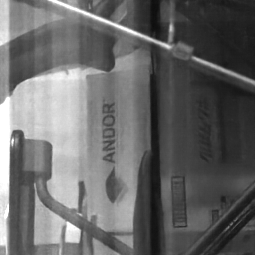</td>
    <td>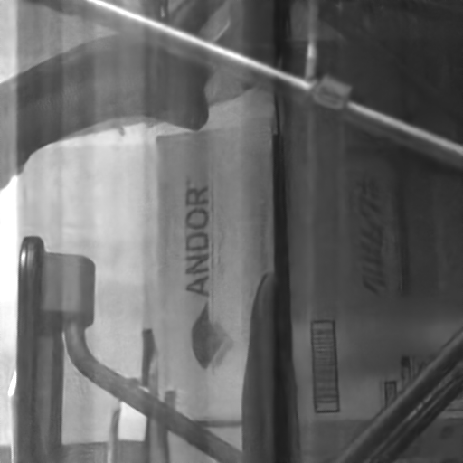</td>
    <td>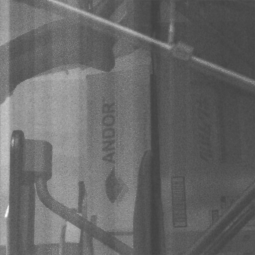</td>
    <td>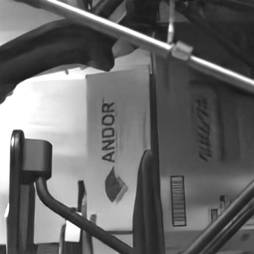</td>
    <td>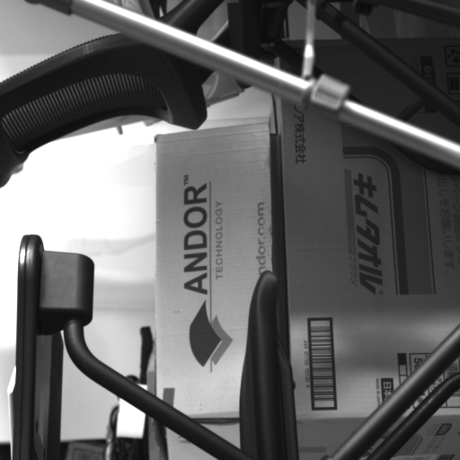</td>
  </tr>
</table>

Real microscopy example (no ground truth is available; the final column uses
the cell-adapted checkpoint):

<table>
  <tr>
    <th>Input</th><th>ELD</th><th>Theoretical</th><th>SRDTrans</th><th>Ours</th><th>Ours + fine-tuning</th>
  </tr>
  <tr>
    <td>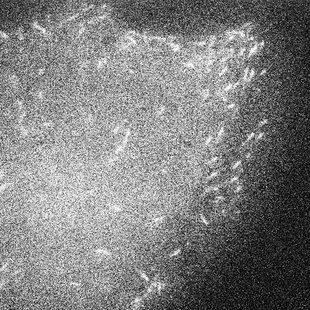</td>
    <td>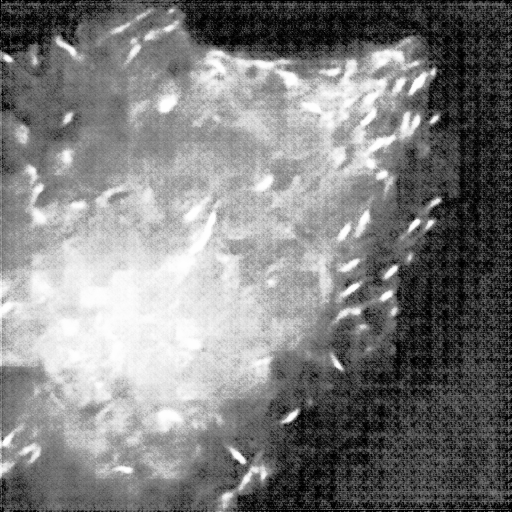</td>
    <td>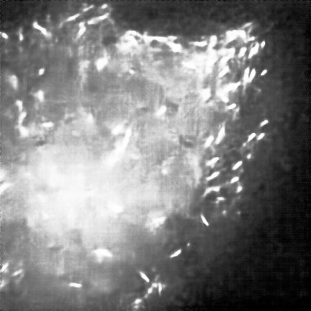</td>
    <td>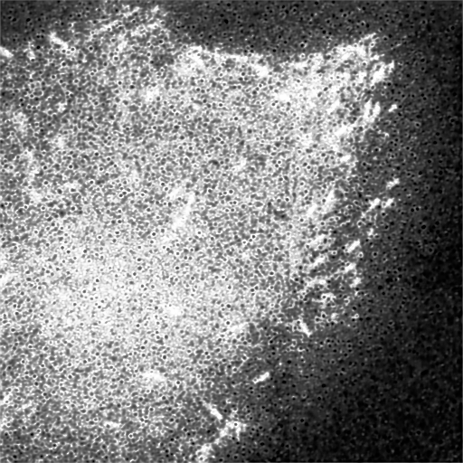</td>
    <td>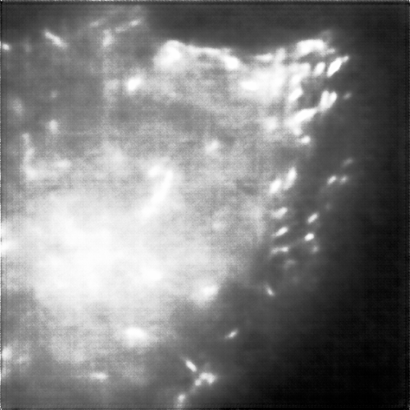</td>
    <td>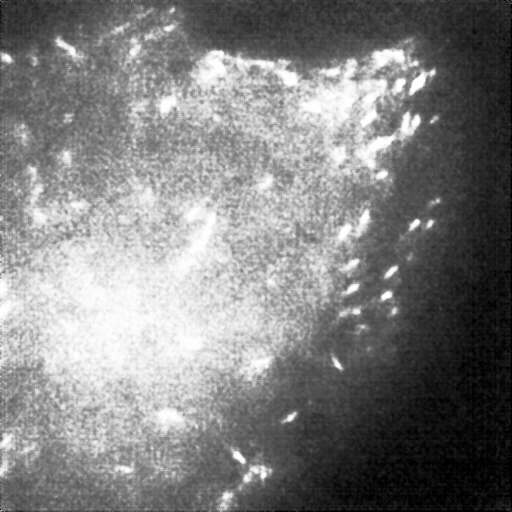</td>
  </tr>
</table>

## Installation

Python 3.9–3.11 and a CUDA-capable PyTorch installation are recommended.

```bash
python -m venv .venv
source .venv/bin/activate
pip install -r requirements.txt
pip install -e .
```

For the paper's LPIPS benchmark, also install `pip install -e '.[benchmark]'`.

For closest numerical reproduction, create the recovered Python 3.9,
PyTorch 1.12.1, and CUDA 11.3 environment instead:

```bash
conda env create -f environment-paper.yml
conda activate emccd-paper
pip install -e . --no-deps
```

[`requirements-legacy.txt`](requirements-legacy.txt) records the same
paper-era Python dependencies for systems where Conda is unavailable.

## Download assets

Release data live outside Git: the downloadable archives total about 163 GB
and expand to more than 230 GB. The downloader verifies every file against
`assets/manifest.json`.
Download the checkpoint and canonical benchmark, and extract the benchmark into
the paths used below, with:

```bash
python scripts/download_assets.py runtime checkpoints benchmark --extract
python scripts/check_setup.py benchmark
```

The resulting important paths are `checkpoints/paper_model_best.pth`,
`data/calibration/runtime/`, and `data/benchmark/`. See [Data](docs/DATA.md) for
all groups, disk requirements, extraction behavior, and checksum verification;
see [Camera Calibration](docs/CALIBRATION.md) for auditing runtime parameters.
The repository includes a small paired benchmark example and a separate
microscopy input so the file conventions can be inspected without downloading
the datasets.

## Inference

Use the paper checkpoint for the paper-distribution example and canonical
benchmark:

```bash
python scripts/infer.py \
  --input examples/paper_pair/input.tif \
  --output outputs/paper_example \
  --weights checkpoints/paper_model_best.pth
```

Use the adapted checkpoint for cell microscopy:

```bash
python scripts/infer.py \
  --input examples/microscopy/input.tif \
  --output outputs/cell_example \
  --weights checkpoints/cell_finetuned_model_best.pth
```

Reproduce the canonical metrics directly from the checkpoint with:

```bash
CUDA_VISIBLE_DEVICES=0 python scripts/benchmark.py \
  --input-dir data/benchmark/preprocessed_input_20240513 \
  --gt-dir data/benchmark/gt \
  --weights checkpoints/paper_model_best.pth --lpips
```

Expected output for 224 images is approximately **48.59215 dB PSNR**,
**0.985367 SSIM**, and **0.074232 LPIPS-VGG**. Small floating-point differences
across CUDA, PyTorch, and LPIPS versions are expected. Use the paper checkpoint
for this benchmark. The cell-fine-tuned checkpoint is intended for microscopy
cell images and is not the checkpoint that produced the paper benchmark table.

`scripts/evaluate.py` can rescore an existing output directory without loading
the network. The benchmark intentionally mean-matches each input to its paired
reference, matching the historical evaluation protocol; ordinary inference
does not require a reference image.

For arbitrary image sizes, inference uses overlapping 512×512 tiles. Inputs
must be grayscale TIFFs in the camera’s 16-bit ADU range. `--input` may be one
TIFF or a directory; outputs retain the input filenames as uint16 TIFFs. If a
camera offset has not already been removed, pass it in ADU with, for example,
`--black-level 100`. Do not use `--black-level` on the supplied preprocessed
benchmark.

## Training

Download and place every paper-training dependency automatically:

```bash
python scripts/download_assets.py runtime training benchmark --extract
python scripts/check_setup.py paper-training
```

Then run the recovered two-GPU protocol (GPU 1 is deliberately excluded):

```bash
CUDA_VISIBLE_DEVICES=0,2 python scripts/train.py --config configs/paper.yaml
```

For cell fine-tuning, first download the paper checkpoint and cell data:

```bash
python scripts/download_assets.py runtime checkpoints benchmark fine-tuning --extract
python scripts/check_setup.py fine-tuning
CUDA_VISIBLE_DEVICES=0,2 python scripts/train.py --config configs/cell_finetune.yaml
```

The paper configuration uses 512×512 patches, ratios sampled uniformly from
1–20, AdamW with learning rate `2e-4`, batch size 4, and 1,000 epochs. Fine-tuning
resumes the paper model for up to 2,000 epochs on the cell dataset. See
[Reproducibility](docs/REPRODUCIBILITY.md) for recovered logs and caveats.
The training path has been verified for a complete first epoch on the paper
data: loss sum `1.319591` and validation PSNR `38.60086`, matching the archived
`1.3196` and `38.6000`. Checkpoint resume and strict reload were also tested.
Repeating all 1,000 epochs takes approximately 27 wall-clock hours on two RTX
3090 GPUs (roughly 54 GPU-hours) in the recovered setup.

Training writes `resolved_config.json`, `training.jsonl`, `model_latest.pth`,
and `model_best.pth` under `outputs/paper/` or `outputs/cell_finetune/`. The
released paper checkpoint is the authoritative artifact for reproducing the
published metrics; a fresh long run follows the recovered stochastic protocol
but is not guaranteed to produce bitwise-identical weights on different CUDA
hardware.

Resume an interrupted run, including optimizer state, with:

```bash
CUDA_VISIBLE_DEVICES=0,2 python scripts/train.py --config configs/paper.yaml \
  --resume-from outputs/paper/model_latest.pth
```

## Recovered result

The released code was verified on all 224 benchmark images and produced
**48.59215 dB PSNR**, **0.985367 SSIM**, and **0.074232 LPIPS**, matching the
recorded **48.59228 / 0.985369 / 0.074235**. The original
January validation pipeline peaked at 47.4564 dB in epoch 537; these numbers
use different preprocessing and should not be interchanged.

## Citation

```bibtex
@inproceedings{jiang2025emccd,
  title={Revolutionizing EMCCD Denoising through a Novel Physics-Based Learning Framework for Noise Modeling},
  author={Jiang, Haiyang and Wazawa, Tetsuichi and Sato, Imari and Nagai, Takeharu and Zheng, Yinqiang},
  booktitle={International Conference on Learning Representations},
  year={2025}
}
```

Code and checkpoints are released under the [MIT License](LICENSE). Released
data are covered by [CC BY 4.0](DATA_LICENSE). The network implementation is
derived from [Uformer](https://github.com/ZhendongWang6/Uformer); see
[NOTICE](NOTICE) for attribution.
